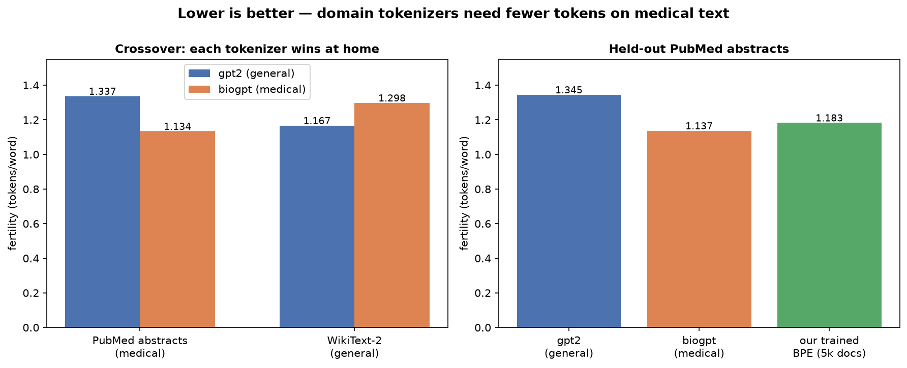
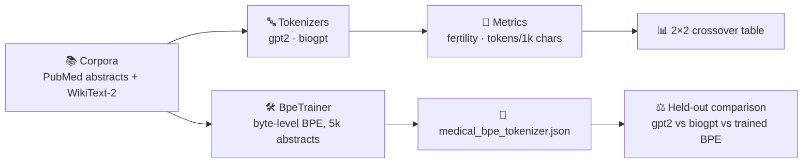

<div align="center">

# 🩺🔤 tokener

**Why do domain-specific tokenizers exist?** A hands-on demonstration that general-purpose tokenizers waste tokens on medical text — and how to train your own with the Hugging Face `tokenizers` library.

[](https://www.python.org)
[](https://huggingface.co)
[](#-option-1--google-colab-zero-install)
[](https://docs.astral.sh/uv/)
[](https://huggingface.co/datasets/scientific_papers)

</div>

---

## 🎯 Overview

A general-purpose tokenizer — trained on generic web text — shatters medical terminology into fragments, burning **context window, memory, and compute** on a domain it was never built for. This repo proves it with real numbers and then fixes it, in three acts:

| Act | What happens | Key takeaway |
|-----|--------------|--------------|
| 🥊 **1** | `gpt2` vs. `microsoft/biogpt` on PubMed abstracts **and** WikiText-2 | The effect **crosses over** per corpus — it's domain mismatch, not tokenizer quality |
| 🪤 **2** | `Bio_ClinicalBERT` vs. `PubMedBERT` tokenizing the same sentence | "Medical model" ≠ "medical tokenizer" — check the vocab files, not the model card |
| 🛠️ **3** | Train a byte-level BPE from scratch on **5,000 abstracts** (~1 min, CPU) | A tiny training run recovers most of the efficiency gap |

> 📖 **Key metric — fertility** (Rust et al., 2021): tokens per word. Lower = more efficient.

## 📊 Results



| tokenizer | PubMed fertility | WikiText-2 fertility | held-out PubMed |
|-----------|:----------------:|:--------------------:|:---------------:|
| `gpt2` (general) | 1.337 | **1.167** | 1.345 |
| `biogpt` (medical) | **1.134** | 1.298 | **1.137** |
| our trained BPE (5k docs) | — | — | 1.183 |

Same sentence, two tokenizers — watch `amoxicillin-clavulanate` and `echocardiography`:

```text
gpt2   (28 tokens): ['The', 'Ġpatient', 'Ġwas', 'Ġprescribed', 'Ġam', 'oxic', 'illin', '-', 'cl', 'av', 'ul', 'an', 'ate', ... 'Ġe', 'ch', 'oc', 'ardi', 'ography', '.']
biogpt (18 tokens): ['The</w>', 'patient</w>', 'was</w>', 'prescribed</w>', 'amoxicillin</w>', '@-@</w>', 'clavul', 'anate</w>', ... 'echocardiography</w>', '.</w>']
```

## 🧭 How it works



## 🗂️ Repository structure

```text
tokener/
├── 📓 notebooks/
│   └── medical_tokenizer_comparison.ipynb   # the teaching notebook (Colab-ready, outputs included)
├── 📦 src/tokener/
│   ├── __init__.py                          # package marker
│   └── pipeline.py                          # the same experiment as a CLI
├── 🖼️ docs/images/
│   └── fertility_results.png                # results chart used above
├── ⚙️ pyproject.toml                        # deps + `tokener` console script
├── 🙈 .gitignore
└── 📖 README.md                             # you are here
```

## 🚀 Getting started

### 📓 Option 1 — Google Colab (zero install)

1. Open [Google Colab](https://colab.research.google.com)
2. Upload `notebooks/medical_tokenizer_comparison.ipynb` (`File → Upload notebook`)
3. `Runtime → Run all` ✅

Runs on a **free tier** in well under 10 minutes. The only package installed on top of Colab's defaults is `sacremoses` (needed by the legacy BioGPT tokenizer).

### 💻 Option 2 — Local, with [uv](https://docs.astral.sh/uv/) (recommended)

```bash
# 1️⃣ Clone the repo
git clone https://github.com/sourangshupal/tokener.git
cd tokener

# 2️⃣ Create the environment and install dependencies
uv sync

# 3️⃣ Run the full pipeline (~2k/5k/1.5k document slices)
uv run tokener
```

### 🐍 Option 3 — Local, with plain pip

```bash
# 1️⃣ Clone the repo
git clone https://github.com/sourangshupal/tokener.git
cd tokener

# 2️⃣ Install in editable mode (adds the `tokener` command)
pip install -e .

# 3️⃣ Run
tokener --help
tokener
```

> 💾 The first run downloads ~350 MB of parquet data + tokenizer files from the Hugging Face Hub (cached afterwards). The trained tokenizer is saved to `medical_bpe_tokenizer.json` — override with `--output`.

### 🎛️ Pipeline options

```text
tokener [--n-metrics 2000] [--n-train 5000] [--n-heldout 1500]
        [--vocab-size 30000] [--min-frequency 2] [--seed 42]
        [--output medical_bpe_tokenizer.json]

# quick smoke run (~2 min):
tokener --n-train 1000 --vocab-size 10000
```

## 🧰 Tech stack

| Library | Role |
|---------|------|
| 🤗 [`tokenizers`](https://huggingface.co/docs/tokenizers) | Rust-backed tokenization: load `gpt2`, train our byte-level BPE (`BpeTrainer`, `train_from_iterator`) |
| 🤗 [`transformers`](https://huggingface.co/docs/transformers) | `AutoTokenizer` for legacy repos (`biogpt`, the BERT family) |
| 🤗 [`datasets`](https://huggingface.co/docs/datasets) + [`huggingface_hub`](https://huggingface.co/docs/huggingface_hub) | Loading PubMed abstracts & WikiText-2 (parquet exports) |
| 📊 `matplotlib` / `pandas` | Charts and tables in the notebook |
| 🐍 `sacremoses` | Moses tokenizer required by BioGPT's legacy fairseq-style pipeline |
| ⚡ [`uv`](https://docs.astral.sh/uv/) | Fast package management & `tokener` CLI entry point |

## ⚠️ Implementation notes (things that bite)

- 📜 **`scientific_papers` / `wikitext` are legacy script-era datasets.** Modern `datasets` refuses to run dataset scripts, so the code loads the Hub's automatic parquet export directly (`hf_hub_download` at revision `refs/convert/parquet`).
- 🧩 **BioGPT is not GPT-2-style BPE.** It's fairseq-style (Moses pre-tokenization + `</w>` end-of-word markers), and recent `transformers` dropped its fast backend — hence `AutoTokenizer` + `sacremoses`, while `gpt2` loads straight into the raw `tokenizers` library.
- 🐛 **Two byte-level training footguns**, both handled: `ByteLevel` defaults to `add_prefix_space=True` (phantom leading space), and without `initial_alphabet=ByteLevel.alphabet()` decoding can silently drop rare characters.
- 🎓 **Honest caveat:** domain vocabulary mainly buys *efficiency* (fertility, context length, cost). Downstream accuracy gains are modest next to domain pretraining — PubMedBERT's own ablations (Gu et al., 2021).

## 🙋 Discussion questions (for the classroom)

1. Your context window is 4,096 tokens — quantify how much more medical text fits with the domain tokenizer vs. `gpt2`.
2. When would a *smaller* vocabulary be the right choice despite higher fertility?
3. Find a biomedical term that even `biogpt` splits. Why might that happen?

## 📚 References

- Rust et al., 2021 — [*How Good is Your Tokenizer?*](https://arxiv.org/abs/2012.15613) (fertility)
- Beltagy et al., 2019 — [SciBERT](https://arxiv.org/abs/1903.10676) (domain vocabulary)
- Gu et al., 2021 — [PubMedBERT](https://arxiv.org/abs/2007.15779) (vocabulary vs. pretraining ablations)
- Hugging Face [`tokenizers` quick tour](https://huggingface.co/docs/tokenizers/quicktour)

---

<div align="center">

Built for teaching 🧑‍🏫 · PRs and issues welcome 🙌

</div>
